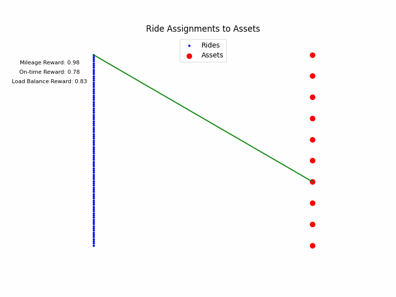
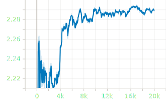
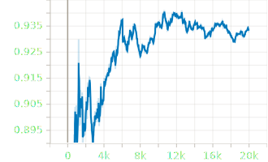
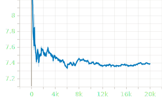
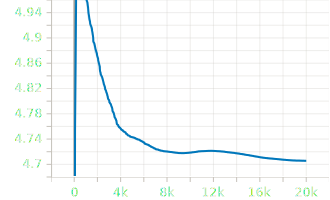
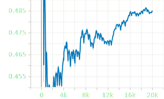
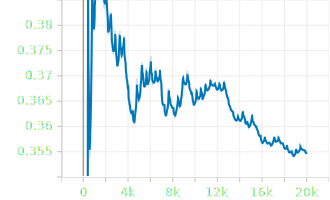
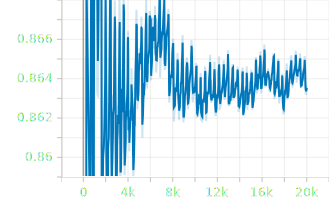
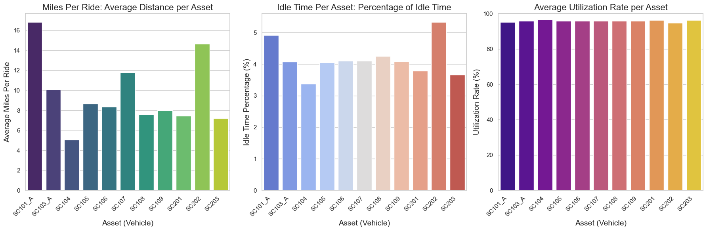
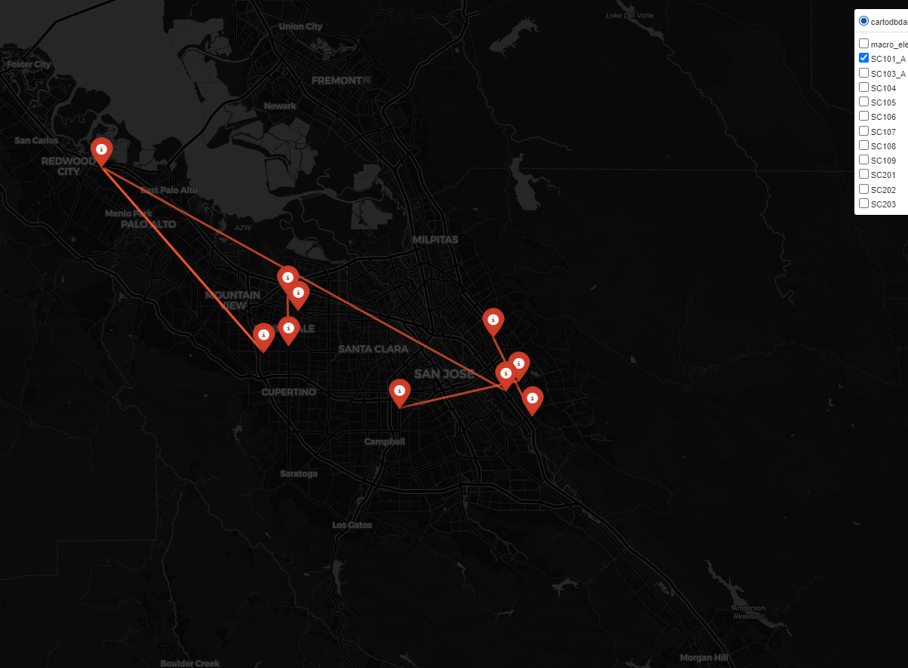

# Advantage Leveraging Transit Reinforcement 
### An overview of AI for NEMT
---
### Feel free to ask questions! 

## About Me

- My background is in AI systems engineering and EDI billing solutions.  
- I have over 17 years of expertise in the NEMT industry.  
- I design and implement automated billing and accounting systems tailored for NEMT operations.  
- I develop AI-driven systems to optimize ride scheduling and resource management.  

## Overview

ALTR is a transportation scheduling system using Reinforcement Learning (RL) to optimize ride distribution across available assets. The goal is to efficiently allocate rides while minimizing mileage, maximizing time efficiency, and balancing distribution across assets.


## But First... What is Reinforcement Learning?

Reinforcement Learning (RL) is a type of machine learning where an agent learns to make decisions by interacting with an environment. The agent takes actions, observes the results, and receives feedback in the form of rewards or penalties. Over time, the agent improves its behavior to maximize cumulative rewards.

### Example: A Robot in a Maze

Imagine a robot navigating a maze to find a charging station before its battery runs out. The robot (agent) explores the maze (environment) and decides which direction to move (action). If it gets closer to the charging station, it receives a reward; if it moves farther away or wastes battery, it gets no reward (or a penalty). Through trial and error, the robot learns the optimal paths to reach the charging station efficiently, avoiding dead ends and unnecessary detours.

This process mirrors RL, where the agent learns strategies to achieve its goal by maximizing rewards.


## Single-Agent RL Scheduling System 
(As opposed to a Multi-Agent system) <br>

This system is designed for NEMT. The agent learns to allocate rides efficiently by considering factors like time, distance, and load balancing. It generates an optimized plan for the entire day, taking into account all assets and rides. With finely tuned learning parameters, the agent continuously improves, adapting to daily, weekly, and monthly trends.

### Side note on learning parameters: 
- Simply put, the agent learns more when it is improving and less when it is not. This approach encourages positive exploration while preventing the agent from reinforcing bad behaviors or getting stuck in sub-optimal outcomes.

### Side note on long-term memory:
- Since the agent retains long-term memory, this learning approach ensures that it only remembers best practices, not those that lead to suboptimal outcomes.

## Feature Definitions

- **Mileage Minimization**: The agent aims to reduce total mileage, improving fuel efficiency and lowering operational costs.

- **Time Efficiency**:  The agent leverages temporal localization to create an efficient time plan across the entire day of rides.

- **Ride Distribution (Load Balancing)**: Optimizes allocation to prevent underutilization of assets.

- **Multi-Loading**: Identifies opportunities to load multiple riders onto a single trip under suitable conditions.

## Upcoming Features

- **Assigned Breaks**: Allows the user to assign designated breaks for drivers, while optimizing the schedule around them. (Lunch breaks, etc)

- **Pre-loading**: Assigns fixed rides, such as school pickups, and optimizes schedules around them. (Example is a public school contract where the TP wants a certain set of assets to be assigned to those rides.)

- **Live Dispatch**: Dynamically adjusts schedules to accommodate new ride requests or cancellations. For example, a TP has a pool of unassigned rides. Whenever there is a change in the environment (e.g., a cancellation or a shift in the load state of assets), the agent identifies new load opportunities that maximize rewards. TPs will also be able to use this feature to assess whether accepting a ride is feasible or not.

- **Ghost Assets**: Simulates additional assets to show how unassigned rides could be managed. A Ghost Asset’s schedule can be outsourced to a subcontractor or used to advise the TP about the need to aquire or utilize additional vehicles.

<!-- 
## Installation
Coming soon <span style="font-size: 2em;">👨‍🔬</span> -->
<!-- 
1. Clone the repository:
   ```bash
   git clone https://github.com/yourusername/transportation-scheduling.git
   cd transportation-scheduling
   ``` -->

<!-- ## Overview
The following data is sourced from a real-life ambulance company that uses ALTR in its daily operations. While the rider names are fictional, the data reflects real-world scenarios. The agent handles several situational variables to the best of its ability. For example, time gaps often occur due to a shortage of rides in certain areas, particularly between 6 AM and 9 AM. These gaps result from low demand during those hours for this company and timeframe. In real scheduling scenarios, human dispatchers typically fill these gaps with same-day or day-prior requests. The system is designed to eliminate the tedium of manual scheduling, allowing dispatchers to focus on more creative tasks, rather than spending hours on repetitive scheduling work. The agent currently integrates standard trips, multi-loaded trips, and pre-scheduled trips. Special rides, such as gurney transports, are being developed but are not yet implemented.

The agent is given certain allowances to break the rules, so in the scheduled data we may see sitations where a an appointment time, and a pickup time for the next ride are very close together, this is due to the local proximity, and buffer time allowances. -->

## How It Works

- The agent receives a list of unordered rides.
- It evaluates each ride based on constraints such as asset shift windows, mileage and time rules.
- Using this evaluation, the agent builds a comprehensive schedule for the entire day, aiming to assign rides to assets in a way that maximizes efficiency and minimizes wasted resources.
- The agent strategically assigns rides to assets, balancing workload distribution, and optimizing for both individual asset performance and overall system efficiency.

---
# Two Types of Ride Scheduling Methods

The process of scheduling rides using reinforcement learning can be approached through two distinct methods, each with its own strengths and limitations:

---
## Current Capabilities and Future Vision

### **1. Naive Sequential Process Scheduling (Current Method)**  
NSPS is the current implementation where the agent processes rides in a **single-state sequential loop**. The system works as follows:
- **Workflow**: The agent loops through all available rides sequentially. Over the course of training, it learns an optimal scheduling policy for the entire day. 

The agent focuses on optimizing time and mileage when scheduling rides, and this works well in practice because rides are often close enough to be combined into a single trip. However, the approach leaves out rides that don’t easily fit into this framework, limiting its ability to handle more complex scheduling scenarios.

- **Strengths**:  
  - Simplicity: The method is straightforward, as the agent focuses on scheduling each ride individually with a long-term plan.
  - Effective for Specific Categories: It performs well for wheelchair rides.

- **Limitations**:  
  - Narrow Scope: The system lacks the ability to dynamically account for the real-time load state of all assets, limiting its adaptability.  

  - Category-Specific: Currently, it is tailored to wheelchair rides and does not generalize to other ride types like **gurney** or **ambulatory** transports.

---

### **2. Dynamic Timing and Resource Optimization (Future Method)**  
DTRO is an advanced approach that incorporates a **multi-state sequential loop** that dynamically considers the load state of all assets throughout the scheduling process:
- **Workflow**: The agent tracks the real-time load state of every asset (e.g., vehicles, available capacity) at each step of the scheduling process. It uses this information to adapt and make optimal decisions for allocating rides.  
- **Feedback-Driven Optimization**: As the agent trains, it receives detailed feedback about successful and unsuccessful scheduling actions. This feedback enables it to refine its policy and create rules for optimizing **all ride categories** (e.g., wheelchair, gurney, and ambulatory).  
- **Strengths**:  
  - **Comprehensive Scheduling**: By considering the state of all assets, the system can make rules for diverse ride types, ensuring efficient utilization of resources.  
  - **Dynamic Adaptability**: The agent can react to changes in asset availability or ride requirements in real-time.  
  - **Unified System**: Unlike the one-to-one method, this approach allows a single agent to manage multiple categories, eliminating the need for separate agents.  
- **Challenges**:  
  - Increased Complexity: The system requires more computational resources and training time to handle the expanded state space and decision-making process.  
  - Developmental Stage: This method is still under active development and has not yet been fully implemented.  

---

### **Looking Ahead**  
While the non-positional one-to-one method provides a solid foundation for wheelchair ride scheduling, its limitations highlight the need for a more advanced approach. The dynamic asset state positional load method represents the future of ride scheduling by enabling the agent to holistically manage diverse categories of transport in a unified system. This evolution will pave the way for more efficient, adaptable, and comprehensive ride scheduling solutions.

## Training (Current Version)
**Naive Sequential Process Scheduling**<br>
Each episode (iteration) during training, the agent loops the rides, taking actions that are an advantage in maximizing the cumulative reward.




### Performance
<div style="margin-left: 130px;">TensorBoard performance metrics for the final training phase, all results are in the intended range.</div>

<table>
   <!-- <tr>
    <td style="text-align: center;">
      
      <div style="margin-left:40px;">Cumulative Rewards Avg</div>
   </td>
   </tr>  -->
  <tr>
    <td style="text-align: center;">
      
      <div style="margin-left:40px;">Mile Reward Avg</div>
    </td>
        <td style="text-align: center;">
      
      <div style="margin-left:40px;">Mile Difference Avg</div>
    </td>
    <td style="text-align: center;">
      
      <div style="margin-left:60px;">Mileage Standard Deviation</div>

  </tr>
  <tr>
  </tr>
    <tr>
      <td style="text-align: center;">
      
      <div style="margin-left:60px;">Load Balance Reward Avg</div>
    </td>
       <td style="text-align: center;">
      
      <div style="margin-left:60px;">Load Balance Standard Deviation</div>
    </td>
   <td style="text-align: center;">
      
      <div style="margin-left:60px;">On-Time Performance Reward Avg</div>
    </td>

  </tr>

  
</table>


<!-- ## Usage

1. **Training the agent:**
   Run the training script to train RL agents:

   ```bash
   python src/main.py --train
   ```

2. **Evaluating Performance:**
   Test the trained agent on new data:

   ```bash
   python src/main.py --evaluate
   ```

3. **Visualizing Metrics:**
   Generate visualizations for metrics:

   ```bash
   python src/visualization/metrics_plotter.py
   ```

4. **Interactive Dashboard (Optional):**
   Launch a dashboard to explore metrics in real-time:
   ```bash
   streamlit run src/visualization/dashboard.py
   ``` -->

---

## Metrics Tracked

### **1. Ride Completion Rate:**
- Depending on shift durations and specific rule parameters around time allowances, mileage restrictions, etc., there can be a small set of rides that go unscheduled for a given set.

### **2. Efficiency Metrics**
- **Miles Per Ride:** Average distance traveled per ride.
- **Idle Time Minimization:** Percentage of time assets spend idle during their shifts.
- **Average Utilization Rate:** Time spent on rides versus total available shift time for assets.



### **3. Distance Efficiency and Agent Behavior**

    

Above, we can see the agent's scheduling decisions for each asset. Notice that the agent focuses on clustering rides together, and that long trips tend to lead to clusters of rides. It’s important to note that the agent will select rides further away if time rewards can be enhanced by combining them with available mileage and load balance rewards, ultimately achieving a higher cumulative reward. 

The agent is able to use historical traffic patterns to very closely predict the approximate travel time at a given time day and even along a given route based on several features within the dataset. This allows the agent's decisions to be more in line with reality.

### **4. Cost Reduction**
- **Fuel Cost Reduction:** The agent solves the problem of maximizing fuel efficiency by custering rides based on mileage, long legs will often lead to clusters, but time composition is the primary determing factor that influences location outcomes.

- **Driver Hours Reduction:** From June 2024 to December 2024, while the number of drivers has remained relatively stable, the focus has shifted toward improving the quality of work. The company using ALTR has started emphasizing hiring practices that prioritize driver capability, particularly their ability to meet the schedules generated by the agent. Over time, this approach may reduce some labor costs, but it is more likely to result in an increase in the number of drivers as improved efficiency drives company growth.

### **5. Scalability**

- **Time to Converge:** Convergence in the current version takes approximately 140,000 steps, improvement is observed every 20,000.
- **Inference Time:** Each schedule on the current hardware used takes about 1 minute (with multi-loading)

### **6. Performance in Edge Cases:**

-  Edge cases are handled through the reward system. If the agent is insufficiently incentivized, it passes the task to a human scheduler. The agent adapts by selecting high-mileage rides that lead to clusters of low-mileage, time-efficient rides, ultimately generating a substantial reward. It also waits for low-mileage opportunities when no other rewards are available, maximizing cumulative reward. For example, if an asset drops off at a dialysis clinic and sufficient rewards are present from that state, the agent waits for the next advantageous time reward, creating small gaps that offer flexibility to human schedulers while ensuring baseline efficiency.

---

### **7. Human Intervention**
- **Skipped Rides:** The agent sometimes skips rides if they can't be fit into an optimal long-term plan, leaving human schedulers to handle adjustments outside the agent's rules. While there are quantifiable rules, some non-quantifiable ones are better managed by humans for now. Future versions will aim to reduce human intervention through a cooperative multi-agent system, where each agent has special rules and can generate "what if" scenarios, such as showing how the schedule might look with additional assets when there aren't enough available.


---

### **8. Multi-Loading**

- **Efficiency of Multi-Loading Assets:** Multi-loading enhances efficiency by strategically pairing compatible rides into "batches," which the agent then processes as a single unit. This approach minimizes the likelihood of skipped rides by ensuring that each asset operates at its fullest potential, without overlooking opportunities for pairing that might otherwise go unused. By grouping rides in a way that optimizes mileage, time and load balance, the system reduces inefficiencies and allows for better use of available assets, ultimately leading to a smoother, more streamlined scheduling process. However a positional multi-load and pre-load system is being planned for future versions.

### **9. Pre-Loading and Asset Ride Assignment**
- Pre-loading is an upcoming feature designed to assign specific rides to designated assets, with the goal of enabling preference-based scheduling. This feature is not fully tested or implemented, but will be integrated into the system in future versions.

### **10. Scheduled Breaks**

- **Integrated Breaks for Planned Downtime:** Not yet fully implemented, future versions will include user specified breaks for each asset. The agent will seamlessly schedule around these time blocks with the same level of efficiency in mileage and OTP.


## Interactive Dashboard
Coming soon <span style="font-size: 2em;">👨‍🔬</span>


## Future Work

- Integration with real-world datasets for live scheduling.
- Enhanced scalability to handle thousands of rides.
- Improved multi-agent collaboration for global optimization.
